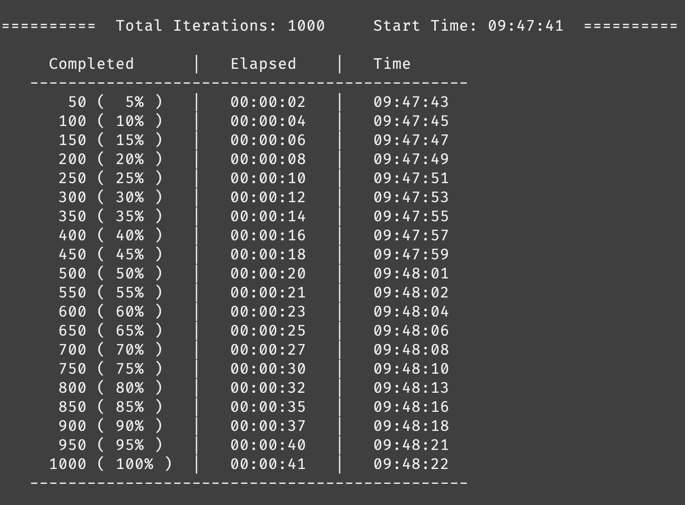

# Display Parfor Loop Progress

Christy Ray

Nov 14, 2022

## Background

`parfor` loops in MATLAB are the parallel equivalent to regular `for` loops, with a few additional quirks. While a regular `for` loop progresses through the iterations in the order of the iterator (e.g., `i = 1`, `i = 2`, etc.), `parfor` executes the loop body in a non-deterministic (i.e., random) order. This makes it more difficult to track the percentage progress through the loop iterations, since it is not as straightforward as simply printing the current iteration index.

`parfor` allows for "reduction" variables, where the variable accumulates a value that depends on all of the iterations together but is independent of the iteration order (e.g., `count = count + 1`). However, the "reduction" variable cannot be accessed in any other way during the loop execution, so, in this example, it is not possible to print the value of `count` during the loop.

## Data Queue

A data queue object allows the parallel workers to communicate information back to the client during the loop execution. The queue is created with `parallel.pool.DataQueue`, and then messages can be sent from the workers with the `send` function. The `afterEach` function executes a particular function every time a message is received.

In the example below, the index of the completed iteration is printed in the command window after each iteration.

```matlab
% Initialize data queue
queue = parallel.pool.DataQueue;

% Display the sent data after each iteration
afterEach(queue, @disp)

parfor i = 1:n
    % Loop body
    
    % Send the current iteration number to the data queue after each iteration
    send(queue, i)
end
```

## Progress Table

Code included in [parfor_progress.m](Code/parfor_progress.m).

I wrote a separate function called `display_progress` to create a formatted table with the progress through the loop iterations. It takes advantage of "persistent" variables in MATLAB - "persistent" variables are stored in the memory outside of the function, so the previous value will be available to the function the next time it is called.

This allows the `display_progress` function to keep track of the number of times it has been called. Since the function is called by `afterEach` when each loop iteration is completed, the number of function calls is equal to the number of loop iterations completed.

To keep track of the elapsed time since the iterations began, the function accepts input of a `tic` variable. `tic` stores the current system time when it is called, and `toc` calculates the elapsed time since the input `tic`.

The function displays the table header when it is first called, and then it adds rows to the progress table based on the number of messages requested.


